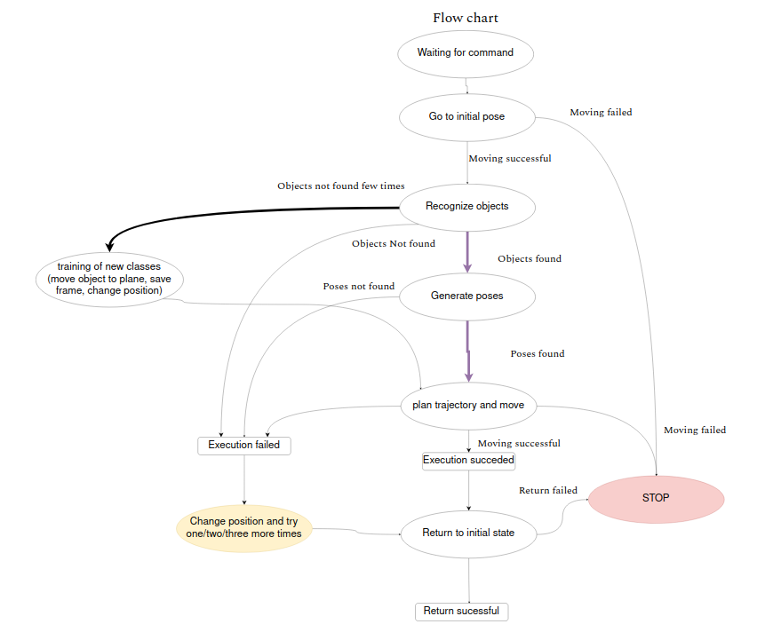
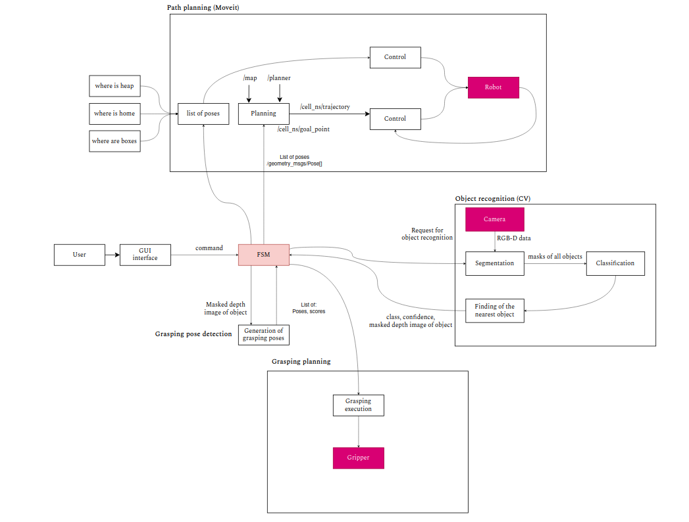

# Автоматизированная робототехниеская система сортировки товаров

Этот репозиторий содержит файлы проекта лаборатории Биомехатроники и Энергоэффективной робототехники Университета ИТМО по созданию автоматизированной робототехнической системы сортировки товаров. Система по данным технического зрения детектирует/классифицирует объекты в пространстве, сортирует их по соответствующим каждому объекту ячейкам, перемещаясь в пространстве с препятствиями. Также система имеет функцию автоматизированного дообучения, позволяющую изучать новые объекты и сортировать их без донастройки программной платформы.

## Аппаратная платформа

Система построена на базе манипулятора [Kuka LBR iiwa](https://www.kuka.com/ru-ru/%D0%BF%D1%80%D0%BE%D0%B4%D1%83%D0%BA%D1%86%D0%B8%D1%8F-%D1%83%D1%81%D0%BB%D1%83%D0%B3%D0%B8/%D0%BF%D1%80%D0%BE%D0%BC%D1%8B%D1%88%D0%BB%D0%B5%D0%BD%D0%BD%D0%B0%D1%8F-%D1%80%D0%BE%D0%B1%D0%BE%D1%82%D0%BE%D1%82%D0%B5%D1%85%D0%BD%D0%B8%D0%BA%D0%B0/%D0%BF%D1%80%D0%BE%D0%BC%D1%8B%D1%88%D0%BB%D0%B5%D0%BD%D0%BD%D1%8B%D0%B5-%D1%80%D0%BE%D0%B1%D0%BE%D1%82%D1%8B/lbr-iiwa). Это коллаборативный манипулятор с 7-ю степенями свободы, который является абсолютно безопасным для человека и может работать рядом с ним без риска нанести ущерб или повредиться.
Система технического зрения построена на базе камеры [Intel Realsense D435i](https://www.intelrealsense.com/depth-camera-d435i/). Стереопара и камера глубины позволяют с большой точностью определять форму, размеры объектов в пространстве и расстояния до них.

## Программная платформа

Программная платформа базируется на фреймворке [MoveIt!](https://moveit.ros.org/) и состоит из модуля детектирования/классификации объектов, модуля планирования движения, модуля захвата объектов, модуля дообучения. Взаимодействие между модулями происходит через конечный автомат (Finite state machine). Цикл работы режима сортировки: Переход в начальное положение -> Детектирование и классификация объектов -> Определение ближайшего объекта и сегментация -> Генерация возможных конфигураций манипулятора для захвата объектов -> Планирование движения робота из текущей конфигурации в конфигурацию для захвата -> Перемещение в новую конфигурацию -> Захват объекта -> Планирование движения до ячейки -> Опускание объекта в ячейку -> Возврат в исходное положение. Блок-схема работы системы представлена на рисунке ниже:

Взаимодействие с системой происходит через пользовательский интерфейс (GUI interface), который осуществляет включение/выключение системы, а также переключение между режимами автоматизированной сортировки и дообучения новых объектов. Конечный автомат (FSM) отправляет запросы в модули и на основании ответов определяет следующие действия системы. Общая архитектура системы представлена на рисунке ниже:

