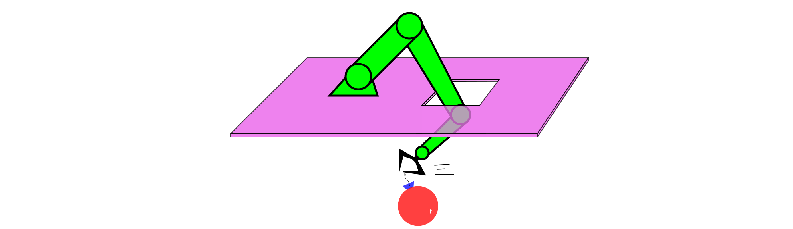

# <p align="center">Grasping Cell</p>

<p align="center"></p>

[]()  


This repository contains the files of the [International Laboratory of Biomechatronics and Energy Efficient Robotics of ITMO University](http://irc.ifmo.ru/en/95913/) project to create a universal platform for sorting known and unknown objects by cells. The system detects / classifies objects in space according to technical vision data, sorts them according to the cells corresponding to each object, moving in space with obstacles. The system also has a function of automated retraining, which allows you to study new objects and sort them without reconfiguring the software platform.

## Overview

- Hardware
- Software
  - [Classification and detection of objects](docs/cv.md)
  - [Pose estimation](docs/grasp.md)
  - [Motion planning](docs/plan.md)
  - [ros-services and FSM](docs/fsm.md)
- How to use
  - [Prerequisites](#prerequisites)
  - [Installation](#installation)
  - [Using](#using)


## Hardware

The system is based on the manipulator [Kuka LBR iiwa](https://www.kuka.com/ru-ru/%D0%BF%D1%80%D0%BE%D0%B4%D1%83%D0%BA%D1%86%D0%B8%D1%8F-%D1%83%D1%81%D0%BB%D1%83%D0%B3%D0%B8/%D0%BF%D1%80%D0%BE%D0%BC%D1%8B%D1%88%D0%BB%D0%B5%D0%BD%D0%BD%D0%B0%D1%8F-%D1%80%D0%BE%D0%B1%D0%BE%D1%82%D0%BE%D1%82%D0%B5%D1%85%D0%BD%D0%B8%D0%BA%D0%B0/%D0%BF%D1%80%D0%BE%D0%BC%D1%8B%D1%88%D0%BB%D0%B5%D0%BD%D0%BD%D1%8B%D0%B5-%D1%80%D0%BE%D0%B1%D0%BE%D1%82%D1%8B/lbr-iiwa). This is a collaborative manipulator with 7 degrees of freedom, which is absolutely safe for a person and can work next to him without the risk of damage or damage.
The vision system is based on a camera [Intel Realsense D435i](https://www.intelrealsense.com/depth-camera-d435i/). A stereo and a depth cameras allow you to determine the shape, size of objects in space and their 
distances with great accuracy.

### The list of harware

- KUKA LBR iiwa 820
- Intel RealSense D435
- Gripper ([this one](https://github.com/be2rlab/uhvat_gripper) looks pretty good)
- PC with rt-kernel
- PC with NVIDIA GPU
- network switch
- 5m usb type-c cable
- Several Ethernet cables


## Software

The software platform is based on a framework [MoveIt!](https://moveit.ros.org/) and consists of an object detection/classification module, a motion planning module, an object capture module, and an additional training module. Interaction between modules occurs through a finite state machine (FSM). Sorting mode work cycle: Go to start position -> Detection and classification of objects -> Detection of the nearest object and segmentation -> Generation of possible configurations of the manipulator for capturing objects -> Planning the movement of the robot from the current configuration to the configuration for capturing -> Moving to a new configuration - > Capturing the object -> Planning the movement to the cell -> Lowering the object into the cell -> Return to the starting position. The block diagram of the system operation is shown in the figure below:


Interaction with the system occurs through the user interface (GUI interface), which enables/disables the system, as well as switching between modes of automated sorting and additional training of new objects. The finite state machine (FSM) sends requests to the modules and, based on the responses, determines the next actions of the system. The general architecture of the system is shown in the figure below:


## How to use

### Prerequisites

- PC with [real time kernel]() linux 
- PC with nvidia graphics and [Ubuntu 20.04,03 Focal Fossa LTS](https://releases.ubuntu.com/20.04/)
- [Robot operating system (ROS) Noetic Ninjemys](http://wiki.ros.org/noetic)
- [Intel RealSense SDK 2.0](https://www.intelrealsense.com/sdk-2/)
- [MoveIt!](https://moveit.ros.org/install/)

### Installation

#### For PC with rt-kernel linux

0. Setup network with `172.31.1.150/16`
1. Add to `~/.bashrc`

```
export ROS_HOSTNAME=172.31.1.150
export ROS_IP=172.31.1.150
export ROS_MASTER_URI=http://172.31.1.150:11311
```

2. Create and setup ros-workspace
3. Install [iiwa_stack](https://github.com/IFL-CAMP/iiwa_stack)


#### For PC with nvidia graphics

0. Setup network with `172.31.1.151/16`
1.  Add to `~/.bashrc`

```
export ROS_HOSTNAME=172.31.1.151
export ROS_IP=172.31.1.151
export ROS_MASTER_URI=http://172.31.1.150:11311
```

2. Create and setup ros-workspace
3. Install [IntelRealSenseSDK](https://github.com/IntelRealSense/realsense-ros)
4. Install this repository

```
roscd
mkdir ../src
cd ../src
git clone --recursive git@github.com:be2rlab/grasping_cell.git
catkin build -j8
```

4. (Optional) Set up a local network between the robot and the computer (not required to run the simulation on the computer).

5. (Optional) Install the scheduler library [OMPL with Modified Intelligent Bidirectional Fast Exploring Random Tree](https://github.com/IDovgopolik/ompl) (you can use the OMPL scheduler library built into MoveIt! to work).

6. Install [grasp generating](https://github.com/be2rlab/grasping_cell/blob/master/contact_graspnet) and [object recognition](https://github.com/be2rlab/grasping_cell/tree/master/computer_vision) modules

### Using

Each step is recommended to be executed in separated terminal windows to monitor all modules states

1. [`for PC with rt-kernel`] Start Kuka control system (we choose one of the following three commands (a, b or c) then we move to the instruction d):

  a. In simulation (rviz):
```bash
roslaunch iiwa_moveit demo.launch
```
  b. Or for execution in Gazebo:
```
roslaunch iiwa_moveit moveit_planning_execution.launch sim:=true
```
  c. Or if we are connecting to a Real Robot, we use:
```
roslaunch iiwa_moveit moveit_planning_execution.launch sim:=false
```
  d. Start the pick and place node:
```
roslaunch iiwa_move_group_interface move_group_interface_iiwa.launch
```

2. [`for PC with rt-kernel`] Start the pick and place node 
```
roslaunch iiwa_move_group_interface move_group_interface_iiwa.launch
```
3. [`for PC with nvidia graphics`] Start Object recognition module according to [this](https://github.com/be2rlab/grasping_cell/tree/master/computer_vision/README.md#using).
4. [`for PC with nvidia graphics`] Start Grasping generating moudle according to [this](https://github.com/be2rlab/grasping_cell/blob/master/contact_graspnet/README.md#using).

**Can be used!**

## Notes 

- [Documentation in Russian](README_ru.md)

## Supported by

BE2RLab of ITMO University: [the site](http://irc.ifmo.ru/en/95913/) and [Github](https://github.com/be2rlab)

## Citation

```
@misc{grasping2022cell,
    author =   {},
    title =    {Universal platform for sorting known and unknown objects by cells},
    howpublished = {\url{https://github.com/be2rlab/grasping_cell}},
    year = {2022}
}
```
