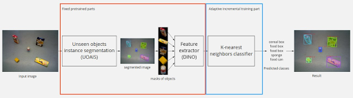
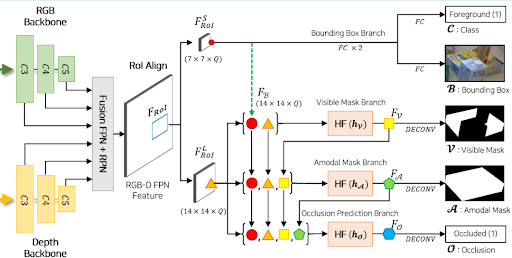

# Classification and detection of objects

Objects are recognized in 2D space by images from the camera. The choice between this method and recognition in 3D space using a point cloud was made in favor of the first, because the second requires large computing power, otherwise the speed and quality of recognition will be low.
Object recognition in images is used for localization in three-dimensional space. To do this, the image is segmented, the resulting mask is applied to the RGB and Depth of the image, and using the internal parameters of the camera, a point cloud of the found objects is built, which allows them to be localized in 3D space in the camera coordinate system.
The task is characterized by a change in the external environment. The recognition algorithm provides for adaptation to new objects in the process of work. 
Given the existing limitations, it was decided to use a pre-trained model for segmenting individual objects [UOAIS](https://github.com/gist-ailab/uoais) in order to obtain object masks, a pre-trained feature extractor [ViT](https://github.com/google-research/vision_transformer) and the k nearest neighbors classifier, which is shown in the figure: 

## Objects segmentation

The Unseen object amodal instance segmentation (UOAIS) algorithm is based on the Mask R-CNN segmentation model, in which the RGB and Depth channels are processed separately. The resulting feature maps are concatenated and fed into the Region Proposal Network. Further, from the entire feature map, only those that belong to the found areas are selected and fed into the branches for detection and segmentation. The first branch refines the frame of the object and its classification (background or object), and the second branch contains the visible mask, the amodal mask (with the visible and hidden parts of the object) and the classification that determines whether the object is covered by other objects. The latter finds its application in robotic object manipulation when the required object is covered by others. 

The architecture of the model is shown in the figure: 

## Objects segmentation

For testing, the data set [CORe50](https://github.com/vlomonaco/core50) was chosen, which serves as a benchmark for continuous learning tasks. This set contains 50 object classes and 120,000 images, which are submitted sequentially in batches of 300 pieces.
[AR1\*](https://arxiv.org/pdf/1912.01100.pdf) was chosen as the main approach, which allows you to save part of the data during new training. On the basis of this approach, additional training of new objects was implemented during the operation of the system, without a significant loss in the quality of recognition of previously learned ones.

[Implementation is provided here.](https://github.com/IvDmNe/unseen_object_segmentation_with_knn_classification/tree/ros_wrapper) 