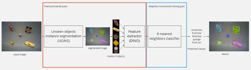

# Модуль детектирования и классификации объектов

Распознавание объектов происходит в 2D пространстве по изоражениям из камеры. Выбор между этим способом и распознаванием в 3D пространстве с использованием облака точек был сделан в пользу первого, потому что для второго требуются большие вычислительные мощности, иначе скорость и качество распознавания будут невелики. 
Распознавание объектов на изображениях применяется для локализации в трехмерном пространстве. Для этого проводится сегментация изображения, на RGB и Depth изображения накладывается полученная маска и с использованием внутренних параметров камеры строится облако точек найденных объектов, что позволяет локализовать их в 3D пространстве в системе координат камеры. 
Для задачи характерно изменение внешней среды. В алгоритме распознавания предусмотрена адаптация к новым объектам в процессе работы.
С учетом имеющихся ограничений было решено использовать предобученную модель для сегментации отдельных объектов [UOAIS](https://github.com/gist-ailab/uoais), чтобы получать маски объектов, предобученный экстрактор признаков [ViT](https://github.com/google-research/vision_transformer) и классификатор k ближайших соседей, что представлено на рисунке:

## Сегментирование объектов

Алгоритм Unseen object amodal instance segmentation (UOAIS) основывается на модели для сегментации Mask R-CNN, в которой RGB и Depth каналы обрабатываются отдельно. Полученные карты признаков конкатенируются и подаются в сеть прогноза областей (Region Proposal Network). Далее из всей карты признаков выбираются лишь те, которые принадлежат найденным областям и подаются в ветви для детектирования и сегментации. В первой ветви проходит уточнение рамки объекта и его классификация (фон или объект), а во второй находятся видимая маска, амодальная маска (с видимой и скрытой частью объекта) и классификация, определяющая, является ли объект перекрытым другими объектами. Последнее находит свое применение в роботизированной манипуляции объектами, когда требуемый предмет перекрыт другими. 

Архитектура модели представлена на рисунке:

## Классификация объектов

Для тестирования был выбран набор данных [CORe50](https://github.com/vlomonaco/core50), служащий в качестве бенчмарка для задач продолжительного обучения (continual learning). Данный набор содержит 50 классов объектов и 120 тысяч изображений, которые подаются последовательно пакетами по 300 штук. 
В качестве главного подхода был выбран [AR1\*](https://arxiv.org/pdf/1912.01100.pdf), который позволяет сохранять часть данных при новом обучении. На основе этого подхода реализовано дообучение новых объектов в процессе работы системы, без существенной потери качества распознавания выученных ранее.

[Реализация представлена здесь.](https://github.com/IvDmNe/unseen_object_segmentation_with_knn_classification/tree/ros_wrapper)