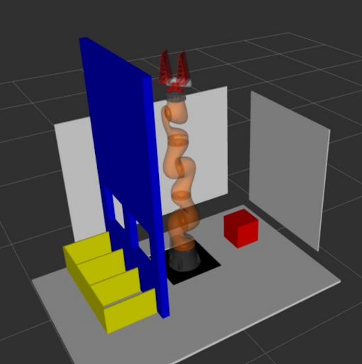
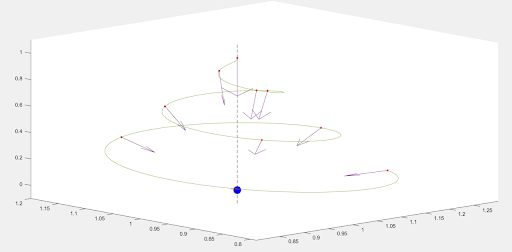

# Описание работы сервисов системы и механизма конечных автоматов

## Общее описание

Сцена представляет из себя манипулятор с захватным устройством и камерой, расположенной на нем, коробку с неотсортированными объектами, несколько коробок, предназначенных для предметов  определенного класса, стена с двумя окнами и стол, на котором все расположено. Внутри коробки лежат различных классов. Начальной позицией манипулятора является расположение над коробкой с неотсортированными предметами с опущенным вниз рабочим органом. Стена с отверстиями является препятствием для движения манипулятора. Сцена во фреймворке MoveIt! представлена на рисунке:



Предметы в коробке распознаются системой компьютерного зрения, для самого ближнего объекта строятся конфигурации для захвата и производится перенос предмета в соответствующую распознанному классу коробку. Если объект найден, но модель компьютерного зрения не уверена в прогнозе, то происходит небольшая смена ракурса со смещением на несколько сантиметров. При неоднократных проваленных попытках распознавания запускается процесс дообучения к новому объекту.
В процессе дообучения можно выделить три этапа:
1. Перемещение объекта на плоскость стола в заданную точку;
2. Сбор изображений объекта с разных ракурсов;
3. Перемещение объекта в коробку.
Для сбора данных была построена спиральная траектория. На траектории равномерно по вертикальной оси выбираются N точек и рассчитывается их ориентация таким образом, чтобы ось Z камеры была направлена на объект в центре спирали. Также мы фиксируем ось X камеры, чтобы она лежала в горизонтальной плоскости, чтобы ограничить вращение. Траектория представлена на рисунке:



Координаты всех коробок на сцене заданы заранее и предполагается, что сцена статичная. 

## Реализация конечного автомата

Для осуществления управления был реализован конечный автомат на базе фреймворка [Smach](http://wiki.ros.org/smach). Он позволяет строить сложные, иерархические конечные автоматы и следить за состоянием. Также имеется интеграция с ROS.
В системе имеется 3 главных модуля:
1. Компьютерное зрение с распознаванием объектов;
2. Генерация позиций для захвата;
3. Планирование и осуществление движения.
Также имелся модуль камеры Intel RealSense, публикующий данные в топики. Связь с модулями было решено осуществлять посредством сервисов.
Модуль компьютерного зрения в режиме инференса при получении запроса от клиента получает RGB и Depth изображения с топиков камеры, проводит сегментацию, классификацию и отправляет ответ, содержащий класс ближайшего объекта, уверенность модели, маску объекта и расстояние до ближайшей точки в пространстве признаков. Также в топик публикуется исходное изображение с нанесенными контурами распознанных объектов для возможности мониторинга работы модуля.  Для режима дообучения предусмотрен другой сервис, реализованный через ROS триггер, сохраняющий наиболее близкий к камере объект в память.
Структура сообщения в ответе представлена ниже:

```txt
std_msgs/Header header
sensor_msgs/Image mask
sensor_msgs/Image masked_depth
string class_name
float32 class_dist
float32 class_conf
```

Модуль генерации позиций для захвата, получив маску объекта, принимает из топиков камеры изображение глубины и внутренние параметры камеры. На основе этих данных строится облако точек видимой части сцены и при помощи алгоритма ContactGraspNet генерируются позиции для захвата объекта. В ответ сервис отправляет массив позиций с численной оценкой уверенности модели в данных конфигурациях. Структура сервиса представлена ниже:

```txt
sensor_msgs/Image mask
---
# response params
bool success
ContactGrasp[] grasps
```

Модуль планирования и осуществления движения имеет несколько полей: массив позиций Poses, номер режима работы WorkingMode и индекс конечной коробки GoalBoxIndex. Предусмотрено несколько режимов работы:
0. схватить предмет, перенести его от текущего положения к заданной коробке и вернуться в начальное положение;
1. Схватить предмет и переместить его в фиксированное место на плоскости для дальнейшего дообучения;
2. Переместить камеру в позицию из поля Poses;
3. Вернуться в начальное положение.
В качестве ответа сервис отправляет поле AllMotionWorked со значением True/False. При отсутствии траекторий к сгенерированным позициям для захвата будет возвращаться значение False в поле GraspWorked. Структура сообщения для ROS сервиса представлена ниже:

```txt
geometry_msgs/Pose[] Poses
int32 GoalBoxIndex # Important only in WorkingMode=0
int32 WorkingMode
# Working modes:
# 0: Grasp, move from start box to goal box and return to init state(length of Poses > 0)
# 1: Grasp and move object to a fixed point on a plane to learn (lenth of poses > 0); 
# 2: Change position to point specified in "Poses" field (length of Poses = 1); used in learning process
# 3: return to initial state (Poses = [])
---
bool GraspWorked
bool AllMotionWorked
```
Для предотвращения сбоев в программе управления вызов каждого сервиса был расположен внутри блока Try-except. Структура представлена ниже:

```txt
def save_feature():
    try:
        srv_proxy = rospy.ServiceProxy(
            'segmentation_train_service', Trigger)
        response = srv_proxy()
        return response
    except rospy.ServiceException as e:
        rospy.logerr(f"Service call failed: {e}")
        return None
```
Также для мониторинга состояния сервисов и топиков была написана функция, проверяющая все необходимые ноды, код которой представлен ниже:

```txt
def check_all_nodes():
    rospy.logwarn('Checking nodes:')
    service_list = ['segmentation_inference_service',
                    'segmentation_train_service', 'GoalPoses', 'response', 'gripper_state']
    success = True
    for service in service_list:
        try:
            rospy.wait_for_service(service, timeout=cfg.timeout)
            rospy.logwarn(f'{service} [OK]')
        except rospy.ROSException as e:
            rospy.logerr(f'{service} [NOT OK]')
            success = False
    rospy.logwarn("")
    rospy.logwarn("Checking topics:")
    topic_list = ['camera/color/image_raw', 'camera/aligned_depth_to_color/image_raw', 'camera/color/camera_info']
    type_list = [Image, Image, CameraInfo]
    for topic, t in zip(topic_list,type_list):
        try:
            rospy.wait_for_message(topic, t, timeout=cfg.timeout)
            rospy.logwarn(f'{topic} [OK]')
        except rospy.ROSException as e:
            rospy.logerr(f'{topic} [NOT OK]')
            success = False
    if not success:
        success = False
    return True
```
## Определение вращения

Для начальной точки и точек над каждой из коробок заранее заданы вращения так, чтобы рабочий орган располагался либо горизонтально, либо вертикально. Для точек при смене ракурса и при дообучении необходимо рассчитывать вращение. Удобнее всего задавать вращение систем координат, зная конечное расположение базисных векторов, через матрицу поворота.
Для случая смены ракурса при нераспознанных предметах изначально задается несколько смещения в системе координат (СК) камеры. В данном случае было задано 6 точек: со смещением на 5 см вдоль каждой оси.  Затем переводим все точки в базовую СК. Далее необходимо получить вектора, соответствующие направлению вектора Z для каждой точки в направлении сегментированного предмета. Для этого из координат центра объекта вычитаются координаты точки. Далее ограничим вектор Y, сонаправив первые две компоненты с компонентами соответствующего вектора системы координат камеры. Таким образом, мы можем однозначно задать третий компонент вектора Y, исходя из требования, что угол между векторами Y и Z равен 90 граудсов и их скалярное произведение равно нулю:
