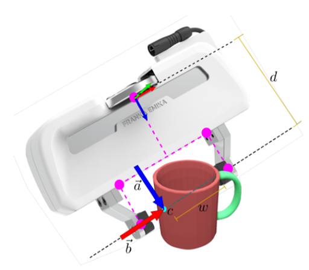

# Определение положения захватного устройства

В качестве основного алгоритма определения конфигурации захватного устройства используется [Contact-GraspNet](https://github.com/NVlabs/contact_graspnet). 

Цель метода Contact-GraspNet – сгенерировать различные конфигурации для захвата объекта без столкновений из облака точек сцены с применением сегментации. Главными преимуществами этого метода являются отсутствие необходимости знания данных об объекте захвата и отсутствие допущения о том, что захваты всегда перпендикулярны поверхности. Предполагается, что хотя бы один из возможных контактов поверхности виден до захвата.

Задача обучения определения захвата с 6 степенями свободы  сводится к оценке вращения захвата с 3 степенями свободы. Представление захвата представлена на рисунке:

В отличие от представлений ось-угол, в таком представлении вращения нет двусмысленностей и разрывов. Уменьшенная размерность значительно ускоряет процесс обучения по сравнению с методами, которые оценивают позы захвата в неограниченном пространстве.
**ВАЖНО!** Для корректной работы алгоритма и применения ко всем объектам на сцене необходима сегментация объектов.

[Реализация модуля здесь](https://github.com/deyakovleva/contact_graspnet/tree/dev_ros)
