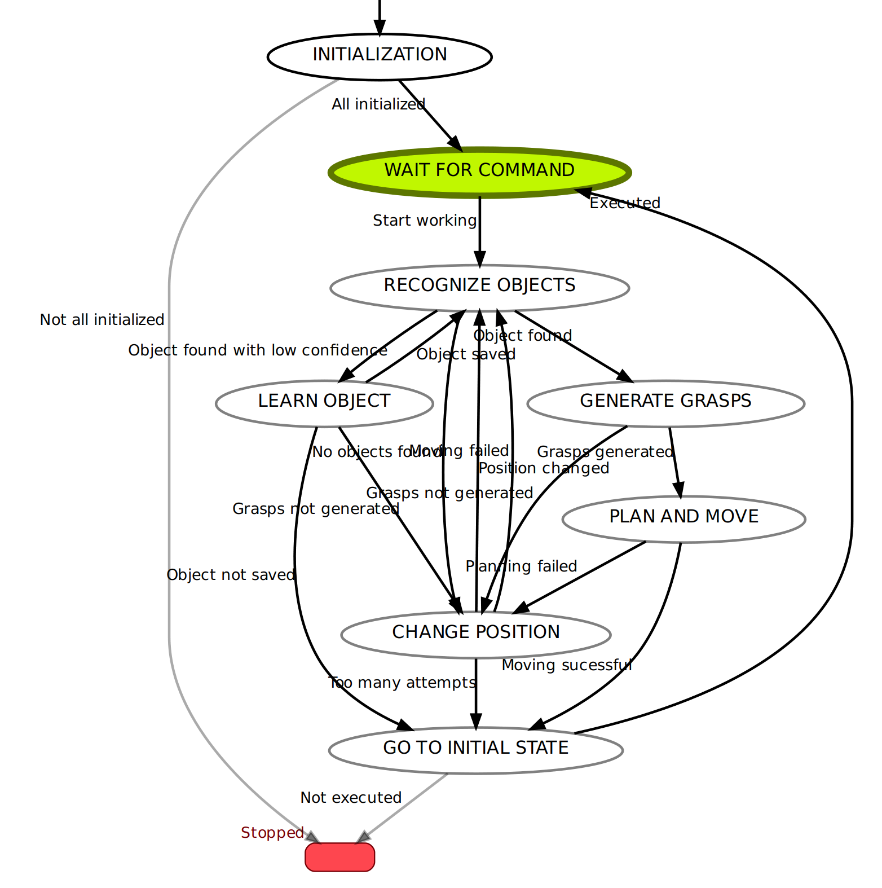

# High-level control
This folder contains finite state machine control algorithm implemented with Smach library

## Installation
1. Install conda environment like in [computer_vision](https://github.com/be2rlab/grasping_cell/tree/master/computer_vision) folder
2. run environment ```conda activate segmentation_ros```
4. run python file: ```python main.py```


# Graph of states


